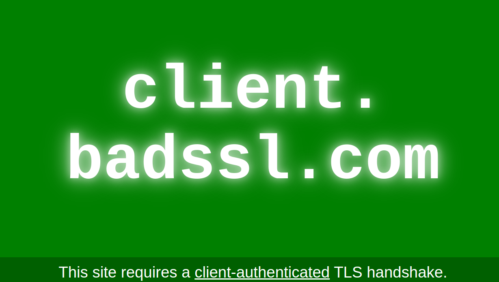

# Playwright Auto Select Certificate for URL

Sometimes need load a certificate from certain URL to authenticate de browser or the user on a website, 
normally the browser opens a popup to select the user certificate, but when make a browser automation needs select the 
certificates programmatically. To attach this on Playwright is very painfully, here explain how to do this and automate 
the selection of certificates for Google Chrome and Firefox.



###### Both examples are based on docker Image for easy test on any environment

### On Google Chrome

Build & Run Docker container: `make build-and-run-chrome`

The site for test all of this is [badssl.com](https://badssl.com)

On the repository exists a right certificate for call the test url, this certificate need to be installed 
on the docker container. This cert is selected automatically for the browser when open the [test url](https://client.badssl.com/)

To configure the auto selection certificates need add a `policies.json` file on certain folder and the browser read these 
policies on the launch of the browser and apply on every url requests. [Source](https://gist.github.com/njh/1d6f2c6acdf39fb3c1b0) - [Documentation about the policy](https://chromeenterprise.google/policies/#AutoSelectCertificateForUrls)

For Google Chrome use the folder: `/etc/chromium/policies/managed`

```json
{
  "AutoSelectCertificateForUrls": ["{\"pattern\":\"*\",\"filter\":{}}"]
}
```

In the dockerfile install the certificate with these command

```dockerfile
RUN pk12util -i "badssl.com-client.p12" -d "${HOME}/.pki/nssdb/" -W "badssl.com"
```

If you run the container with the image build the output is this for a correct certificate accepted for the url:

```html
<div id="content">
  <h1 style="font-size: 12vw;">
    client.<br>badssl.com
  </h1>
</div>

<div id="footer">
  This site requires a <a href="https://en.wikipedia.org/wiki/Transport_Layer_Security#Client-authenticated_TLS_handshake">client-authenticated</a> TLS handshake.
</div>
```

If the certificates is not installed and run the container fail on the authentication requests and the output is:

```html
<center><h1>400 Bad Request</h1></center>
<center>No required SSL certificate was sent</center>
<hr><center>nginx/1.10.3 (Ubuntu)</center>

<!-- a padding to disable MSIE and Chrome friendly error page -->
<!-- a padding to disable MSIE and Chrome friendly error page -->
```

<sub>
This method only works if headlees=False and for run this on docker use the utility Xvfb,
can't select the certificates on headless mode. 
</sub>

### On Firefox

Build & Run Docker container: `make build-and-run-firefox`

The approach in Firefox is different, at the moment we can found any way with Playwright to set the preference of the 
Firefox after launch the browser, to achieve this need launch the browser two times:

The first with a persistent context to generate the default profile in the browser and immediately close and update the 
profile generated with the config that we need.

The second launch gain with the persistent context but the browser load automatically the profile files set on the 
previous step, We set the automatic selection of the certificates and load in this case a PKCS12 certificate on the 
sqlite db used by default for Firefox.

Default profile preference file is `prefs.js` and add this code in the last line if not exists

```js
user_pref("security.default_personal_cert", "Select Automatically");
```

To load de certificates on the `cert9.db` use the `pk12util` [link](https://firefox-source-docs.mozilla.org/security/nss/legacy/reference/nss_tools__colon__pk12util/index.html)

```bash
pk12util -i "./badssl.com-client.p12" -d "{default_profile_dir}" -W "badssl.com"
```

Success load of the certificates

```html
<div id="content">
  <h1 style="font-size: 12vw;">
    client.<br>badssl.com
  </h1>
</div>

<div id="footer">
  This site requires a <a href="https://en.wikipedia.org/wiki/Transport_Layer_Security#Client-authenticated_TLS_handshake">client-authenticated</a> TLS handshake.
</div>
```

If the certificates is not installed and run the container fail on the authentication requests and the output is:

```html
<center><h1>400 Bad Request</h1></center>
<center>No required SSL certificate was sent</center>
<hr><center>nginx/1.10.3 (Ubuntu)</center>
```
<sub>
Disclaimer this is a workaround and is bad idea implement this on critical production environments.
</sub>
